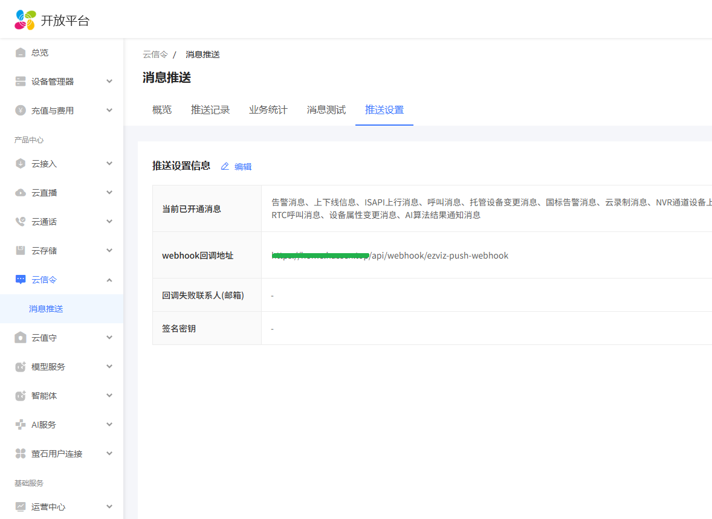

# EZVIZ Cloud Push

萤石云消息推送集成，将萤石账号下支持消息推送的设备接入 Home Assistant。

## 功能

- 接收萤石云 webhook 推送（报警、呼叫、上下线、设备状态、设备配置变更）
- 自动注册多设备，每个设备独立创建实体
- 支持账号下任何能上报消息的萤石设备，推送服务不区分设备型号，具体事件取决于设备能力。已验证可用的设备类型：
  - 门铃、猫眼：呼叫、报警、设备状态（呼叫类消息通常由门铃类设备产生）
  - 摄像机（IPC）：报警、设备状态、上下线
  - 智能门锁：报警（开关门等事件以报警消息推送）
- 支持的消息类型：`ys.alarm`（报警）、`ys.calling`（呼叫）、`ys.onoffline`（上下线）、`ys.devicestatus`（设备状态）、`ys.shadow.change`（配置变更）
- 传感器：电池电量、WiFi信号、SD卡健康度、SD卡容量、充电状态、报警时间、呼叫时间、呼叫动作（响铃/接听/挂断）、人脸识别ID、报警类型、最近事件、最后活动时间
- 开关：在线状态、呼叫按铃、报警触发、布防状态、移动检测开关
- 摄像头：报警图片、呼叫封面图片
- 设备信息重启后持久化保留

## 安装

### 方式一：HACS（推荐）

1. 确保 HA 已安装 [HACS](https://hacs.xyz/)
2. HACS → 集成 → 右下角「自定义仓库」→ 添加：
   - 仓库地址：`https://github.com/ha-china/ezviz_push`
   - 类别：Integration
3. 在 HACS 列表中搜索「EZVIZ Cloud Push」→ 点击「安装」
4. 重启 Home Assistant
5. 设置 → 设备与服务 → 添加集成 → 搜索「EZVIZ Cloud Push」
6. 配置 webhook ID（**务必用随机复杂字符串，不要用默认值**，见下方安全建议）

### 方式二：手动安装

1. 将 `custom_components/ezviz_push/` 复制到 HA 的 `config/custom_components/` 目录
2. 重启 Home Assistant
3. 设置 → 设备与服务 → 添加集成 → 搜索 "EZVIZ Cloud Push"
4. 配置 webhook ID（**务必用随机复杂字符串，不要用默认值**，见下方安全建议）

## 萤石云后台配置

> ⚠️ **前置条件：外网可达**
>
> 萤石云需要从公网把事件推送到你的 HA，因此 HA 必须能被外网访问。请任选其一：
> - **公网 IP**：家庭宽带分配了公网 IPv4/IPv6，路由器做端口转发
> - **内网穿透**：如 frp、ngrok、Cloudflare Tunnel、Tailscale Funnel 等
> - **云服务器反代**：用一台有公网的服务器反向代理到本地 HA
>
> 推送地址必须为 HTTPS，否则萤石云与 HA 均会拒绝连接。

> 🔐 **安全建议：webhook ID 越复杂越好**
>
> webhook 地址（`/api/webhook/<ID>`）暴露在公网，任何人拿到它都能伪装成萤石云推送伪造事件。
> **务必把默认的 `ezviz-push-webhook` 改成一段随机复杂字符串**（如 `ezviz-e8f3a7c2-9b41-4d6e-a5c2-7f3b9d21`），
> 不要用常见或可猜的 ID。安装时手动配置，并同步填写到萤石云后台。

1. 登录 [萤石开放平台](https://open.ys7.com/)
2. 进入 消息推送 → 新增推送地址
3. URL 填写：`https://你的HA公网地址/api/webhook/你的随机webhookID`
4. 保存后，萤石云会自动推送设备事件到 HA

> 📌 **官方推送规则（来自萤石社区）：**
>
> - 告警消息需设备处于**布防状态**才会触发上报，收不到报警时先检查布防开关
> - 呼叫消息通常由门铃类设备产生
> - 试用版套餐只推送账号下 10 台设备的消息
> - 回调需 2 秒内返回 HTTP 200，超时视为推送失败；1 分钟内失败率过半会触发平台降级




## 人脸识别配置（可选）

> 前提：设备支持人脸识别，且已在萤石 App 开启并登记人脸。萤石云推来的 `faceId` 是设备侧的内部编码而非姓名，
> 可通过本集成的「选项」配置映射表，让 `face_id` 传感器直接显示人名。

### 第一步：获取 faceId 编码

`faceId` 是萤石设备人脸库里的内部编码（一串字符），App 里不直接展示。获取方法：

1. 让已登记的人触发一次设备人脸检测（在镜头前出现）
2. 触发后，`face_id` 传感器会显示该人的 faceId 原始编码（映射未配置时显示编码本身）
3. 记下这串编码
   - 也可在传感器详情页的 `raw_face_id` 属性里查看
   - 或开 debug 日志，查找 `Alarm faceId:` 那一行

### 第二步：配置映射

1. 设置 → 设备与服务 → EZVIZ Cloud Push → **选项**
2. 在「人脸映射」里按 `faceId:人名` 填写，用逗号或换行分隔多条，例如：
   ```
   1a2b3c:爸爸, 4d5e6f:妈妈
   7g8h9i:自己
   ```
3. 保存后，下次该人出现时 `face_id` 传感器直接显示人名
4. 原始 faceId 编码始终保留在 `raw_face_id` 属性里，可用来做自动化匹配

> 未登记的人脸触发时，`face_id` 传感器显示「未录入人脸」。

映射数量不设上限，设备人脸库能登记多少人就能映射多少人。


## 实体列表

每个设备会创建以下实体。不同设备类型推送的事件不同：

> 💡 **说明：实体会随数据自动出现**
>
> 没有收到过对应数据的实体**不会显示**（而不是显示「不可用」）。萤石云每次只推送有需要/有变化的信息，
> 因此只有当某类事件（呼叫、报警、设备状态上报等）首次推送后，对应的实体才会出现并填充数值。
>
> 已出现的实体会持久化记录，重启 Home Assistant 后直接恢复，无需重新等待事件。

| 类型 | 实体 | 说明 |
|------|------|------|
| sensor | battery_level | 电池电量 |
| sensor | wifi_signal | WiFi信号强度 |
| sensor | sd_health | SD卡健康度 |
| sensor | sd_capacity | SD卡容量 |
| sensor | sd_status | SD卡状态 |
| sensor | sd_first_record_time | SD卡首次录像时间 |
| sensor | screen_brightness | 屏幕亮度 |
| sensor | energy_mode | 省电模式 |
| sensor | microphone_volume | 麦克风音量 |
| sensor | card_key_count | 门卡数量 |
| sensor | charging_status | 充电状态（属性：power_status / power_value） |
| sensor | alarm_time | 报警时间（最近一次，任意类型；属性：alarm_id、channel_name、custom_type、location、describe） |
| sensor | alarm_time_* | 各报警类型的触发时间独立实体（如 `alarm_time_loiterdetection` 徘徊检测、`alarm_time_smartfacedet` 人脸检测），互不覆盖 |
| sensor | calling_time | 呼叫时间 |
| sensor | calling_action | 呼叫动作（响铃/接听/挂断） |
| sensor | face_id | 人脸识别（显示配置的人名/原始码，未识别时显示「未录入人脸」） |
| sensor | alarm_type | 报警类型 |
| sensor | last_event | 最近事件 |
| sensor | last_seen | 最后活动时间（时间戳） |
| binary_sensor | online | 在线状态（属性：nat_ip 设备公网 IP） |
| binary_sensor | doorbell_ring | 呼叫按铃（30秒自动复位） |
| binary_sensor | alarm | 报警触发（30秒自动复位） |
| binary_sensor | armed | 布防状态 |
| binary_sensor | detection_enabled | 移动检测开关（属性：detection_plan 布防计划表） |
| binary_sensor | detection_enabled_* | 按检测类型独立开关：人形检测、人脸识别检测、徘徊检测、陌生人检测等（来自设备智能应用配置） |
| binary_sensor | night_light_enabled | 夜灯开关 |
| binary_sensor | mute_enabled | 静音开关 |
| camera | calling_picture | 呼叫封面图片 |
| camera | alarm_picture_* | 报警图片按报警类型独立实体（如 `alarm_picture_loiterdetection` 徘徊检测、`alarm_picture_smartfacedet` 人脸检测、`alarm_picture_intelligentdetection` 智能检测），互不覆盖，随首个该类型报警出现 |